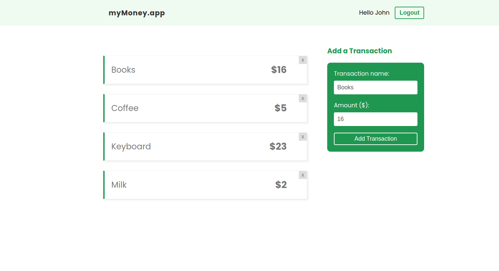

# myMoney

Expenses Tracker app

  <kbd>
    
  </kbd>

## Description

Expenses tracker app built with react and firebase. Manage your transactions to keep tracking your expenes.

### Features

- Signup
- Login
- Logout
- Add transaction
- Delete transaction

### Built with

- React
- React Context API
- Firebase
- Css

## Getting started

### Install

npm install

### Usage

npm start

Thanks to all who helped inspire this template.

### License

This project is licensed under the [MIT License](LICENSE.md).
